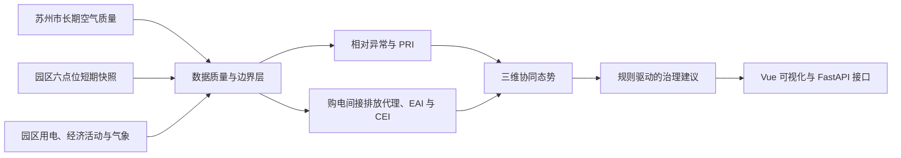
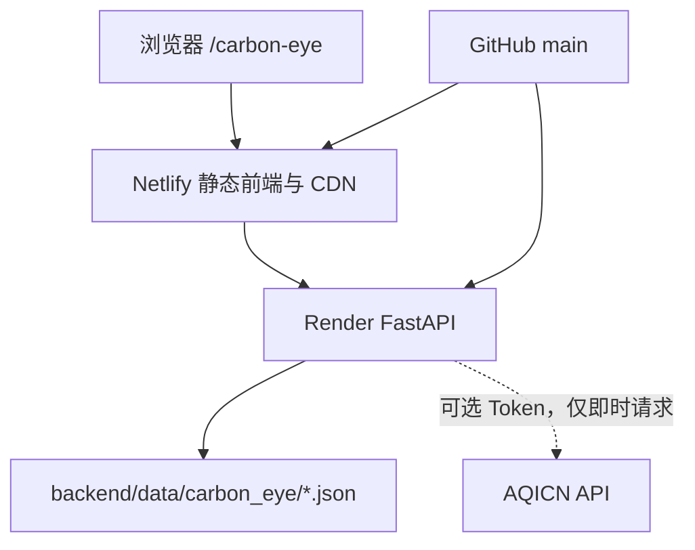

# “园区碳眼”：城市背景、园区短期监测与购电间接排放代理融合的减污降碳协同治理原型

> 文档类型：双碳竞赛技术论文初稿
>
> 版本：v1.0
>
> 证据截止日期：2026-07-18
>
> 适用定位：温室气体与大气污染监测控制方向
> 学术状态：项目技术论文，尚未经过同行评议

## 核心论点

在园区连续能耗、直接燃烧和企业级碳核算数据尚不完备的条件下，通过明确区分“城市长期背景、园区短期监测、购电间接排放代理和实验性协同指标”，仍可构建一个可复现、可解释且不越过数据边界的工业园区减污降碳治理原型。

## 摘要

工业园区既是能源消费和产业活动集聚区，也是减污与降碳协同治理的重要场景。现有公开数据常存在空间尺度、时间频率和核算边界不一致的问题，容易将城市空气质量、园区短期监测和碳排放估算混为一谈。本文以苏州工业园区治理场景为对象，构建“园区碳眼”多源数据融合原型系统。系统整合了 2013 年 12 月至 2026 年 7 月的 152 条苏州市月度空气质量记录、2013 年 12 月至 2015 年 7 月的 602 条日级记录、2013 年 12 月至 2026 年 6 月的 151 个完整月份 ERA5 六点位空间平均气象数据、2026 年 6 月园区 6 点位 7 天 14 项特征因子共 84 条官方短期监测记录，以及 2019、2023、2024、2025 年园区官方用电和经济活动数据。针对日表 CO、NO2、SO2 字段顺序异常，本文在每月 6 种映射中选择与月表均值误差最小的映射，20 个月中有 18 个月发生纠偏，平均相对误差为 0.0182。

方法上，本文将“相对异常”和“绝对污染压力”拆分：前者采用 2013—2022 年同月历史 90% 分位数，后者采用由 NO2、SO2、CO、PM2.5 和 O3 标准化值构成的污染压力指数 PRI。园区碳模块采用江苏省 2023 年电力平均 CO2 排放因子 0.5827 kgCO2/kWh，形成“购电间接排放位置法代理值”，不将其表述为园区总碳排放。能源活动指数 EAI、购电间接排放强度指数 CEI 与 PRI 默认以三维态势展示；混合时间频率 CDCI 仅作为实验性选项并开展三组权重敏感性比较。

描述性结果表明，2014—2025 年苏州市月均 PM2.5、PM10 和 NO2 分别下降 55.5%、41.6% 和 46.7%，而 O3 月均值上升 11.6%，显示污染治理关注点由颗粒物单一压力向臭氧及复合风险延伸。151 个月样本中，O3 与短波辐射的 Pearson、Spearman 和去季节 Pearson 相关系数分别为 0.8402、0.8530 和 0.5184；该结果仅表示描述性相关，不构成因果识别。园区购电间接排放代理值由 2019 年的 802.997 万吨 CO2 增至 2025 年的 1045.530 万吨 CO2，但每万元 GDP 代理强度由 0.2927 tCO2 降至 0.2511 tCO2。研究证明，严谨的数据边界、可解释指标和可追溯数据链能够将空气质量展示升级为园区协同治理决策原型，同时也揭示真实园区碳核算仍需补充天然气、热力、工业过程、交通和企业级能源数据。

**关键词：** 工业园区；减污降碳；空气质量；购电间接排放；气象再分析；协同治理；苏州工业园区

## 术语与边界

| 术语 | 本文含义 | 不代表 |
|---|---|---|
| 城市空气质量背景 | 苏州市尺度的月度和日级空气质量数据 | 园区内部连续监测 |
| 园区官方短期监测快照 | 2026 年 6 月、6 点位、7 天、14 项特征因子 | 全年均值、实时序列 |
| 购电间接排放位置法代理值 | 用电量乘江苏电力平均 CO2 排放因子的统一因子情景 | 园区总碳排放、正式组织碳核算 |
| 相对异常 | 超过 2013—2022 年历史同月 90% 分位数 | 达到法定污染预警级别 |
| PRI | 原型污染压力排序指标 | 官方 AQI 或行业标准 |
| CDCI | 混合月度 PRI 与年度 EAI/CEI 的实验性原型 | 实时碳排放监测或正式评价指数 |
| 描述性相关 | 变量在样本中的共同变化关系 | 因果效应 |
| 指示型/可能关联型 | 提示优先排查的活动方向 | 对企业、交通或行业定责 |

## 1 引言

工业园区集中了制造业、公共能源基础设施和物流活动，是实现产业绿色转型的重要空间单元。已有研究指出，工业园区能源基础设施的更新与协同管理能够同时影响能源效率和 CO2 排放路径[1]。另一方面，工业过程排放可能构成不可忽略的减排来源，仅用电力代理不能覆盖完整碳排放边界[2]；城市碳足迹研究也表明，生产与消费活动的空间联系具有显著跨区域特征[3]。因此，一个面向园区的数字治理系统必须区分环境浓度、能源活动和碳排放核算，而不能把空气污染物浓度直接等同于 CO2 排放量。

《国家碳达峰试点（苏州工业园区）实施方案》提出产业绿色低碳转型、能源利用效率提升、基础设施低碳化和数字赋能等任务[4]。这为构建园区尺度的“监测—解释—估算—决策”链条提供了政策场景。然而，公开数据仍存在三类断点：一是多年空气质量数据主要为苏州市尺度；二是园区特征因子监测仅为短期补充快照；三是公开能耗数据只覆盖部分年度，且缺少天然气、热力和工业过程数据。

本文不回避这些断点，而是提出一种分层原型：

1. 以城市空气质量构建长期背景和相对异常基线；
2. 以园区六点位官方短期监测补充园区空间证据；
3. 以园区用电和区域电力因子构建购电间接排放代理；
4. 以长期气象再分析进行描述性解释；
5. 以 PRI/EAI/CEI 三维态势和规则模板辅助治理决策。

本文的贡献不在于宣称完成正式碳核算，而在于建立可追溯的数据边界和可复现的系统闭环。

## 2 研究问题与系统目标

本文回答四个问题：

1. 如何在城市级长期空气质量和园区级短期监测并存时，避免空间尺度误用？
2. 如何在缺少完整园区能源清单时，对购电间接排放进行有限边界估算？
3. 如何分离“历史同期异常”与“当前绝对污染压力”？
4. 如何将月度污染、年度能源和年度强度数据组合成可解释态势，而不把混合频率指标包装成实时结果？

对应的系统目标是形成以下数据闭环：



## 3 数据与质量控制

### 3.1 数据清单

| 数据层 | 时间/空间范围 | 记录量 | 用途 | 主要边界 |
|---|---|---:|---|---|
| 月度空气质量 | 苏州市，2013-12—2026-07 | 152 月 | 长期趋势、PRI、异常识别 | 不是园区内部监测；2026-07 为部分月 |
| 日级空气质量 | 苏州市，2013-12-02—2015-07-31 | 602 日 | 字段纠偏、历史案例回放 | 不外推为 2016—2026 日级结论 |
| 长期气象 | 园区 6 点位 ERA5 空间平均，2013-12—2026-06 | 151 完整月；27,570 点位日记录 | 描述性相关 | 再分析数据，不是地面站实测 |
| 园区环境快照 | 6 点位，2026 年 6 月连续 7 天 | 14 项、84 条 | 园区特征因子补充证据 | 不是全年或实时序列 |
| 园区用电 | 2019、2023、2024、2025 | 4 年 | EAI、购电间接排放代理 | 2020—2022 不插值 |
| 经济活动 | 园区 GDP、规上工业总产值 | 4 年 | 强度代理 | 宏观指标，不是企业碳强度 |
| 城市 CO2 清单 | 苏州市年度 | 20 年 | 城市碳背景 | 不代表园区排放 |
| 产业画像 | 园区官方六类产业 | 6 类 | 建议适用范围 | 能碳特征和 KPI 为专家规则模板 |

### 3.2 日表字段纠偏

原始日表的 CO、NO2、SO2 字段存在顺序异常。系统对每一个可与月表对应的月份枚举 3 个字段的 6 种排列，将日均聚合后的月均值与月表同月值比较，并选择平均相对误差最小的映射。20 个可校验月份中，18 个月采用了非原始顺序映射，最终平均相对误差为 0.0182。

该方法只能纠正“字段排列”问题，不能证明原始观测本身不存在仪器误差或缺测偏差。因此系统保留 `cleaning_log.csv`，使每个月的候选映射和误差可以追溯。

### 3.3 部分月处理

`2026-07` 被显式标记为：

```json
{
  "is_partial": true,
  "excluded_from_annual_statistics": true,
  "observation_days": null
}
```

该记录只用于页面提示，不参与年度均值、同比、训练基线、异常阈值和气象相关分析。气象序列截止到运行日前最后一个完整月，即 2026 年 6 月。

### 3.4 气象数据质量

系统按 6 个园区官方监测点分别请求 Open-Meteo Historical Weather API 的固定 ERA5 模型，再聚合为空间月均序列[7]。每月完整性要求为 6 点位齐全且点位日覆盖率不低于 95%。风向采用风速加权圆形平均：

\[
\bar{\theta}=\operatorname{atan2}\left(\sum_i w_i\sin\theta_i,\sum_i w_i\cos\theta_i\right)
\]

而不是对角度做普通算术平均。当前 151 个月均通过完整性校验，无大面积空值。

## 4 方法

### 4.1 污染压力指数 PRI

对 NO2、SO2、CO、PM2.5 和 O3 分别在当前分析数据集内进行 min-max 标准化：

\[
z_{p,t}=100\times\frac{x_{p,t}-\min(x_p)}{\max(x_p)-\min(x_p)}
\]

随后计算：

\[
\mathrm{PRI}_t=0.25z_{\mathrm{NO2},t}+0.20z_{\mathrm{SO2},t}
+0.20z_{\mathrm{CO},t}+0.20z_{\mathrm{PM2.5},t}+0.15z_{\mathrm{O3},t}
\]

PRI 仅用于样本内排序与解释。其权重是项目原型的专家假设，不是国家或行业标准；min-max 标准化依赖当前样本范围，新增极端值可能改变历史分数。系统将 0—40、40—70、70—100 分别标为低、中、高污染压力，但这些等级同样属于原型规则。

### 4.2 相对异常与绝对风险分离

相对异常阈值按月分别建立：

\[
T_{m,p}=Q_{0.90}\{x_{y,m,p}:2013\le y\le 2022\}
\]

当 2023 年及之后某完整月的污染物或 PRI 超过其历史同月阈值时，`relative_anomaly=true`，并记录 `anomaly_items`。这一状态不等于绝对污染水平已经很高。例如，低绝对风险月份也可能因超过历史同期而成为趋势异常。

### 4.3 非因果风险类型

系统根据各污染物对 PRI 的贡献排序形成解释标签。旧标签“交通燃烧型”和“工业燃烧型”已改为“含氮燃烧活动指示型”和“含硫工业燃烧可能关联型”。这些标签只用于确定优先排查方向，不对具体企业、交通或行业定责。

### 4.4 气象—污染描述性相关

空气质量与气象数据按完整月份合并，计算：

1. Pearson 线性相关；
2. Spearman 等级相关；
3. 各变量减去其历年同月均值后的 Pearson 相关。

第三种方法用于削弱共同季节性造成的表面关系，但仍不是因果识别。本文不使用“气象因素导致污染变化”的表述。

### 4.5 园区购电间接排放位置法代理

江苏省 2023 年电力平均 CO2 排放因子为 0.5827 kgCO2/kWh[6]。当用电量单位为亿千瓦时时：

\[
E^{proxy}_{10^4tCO2}=Electricity_{10^8kWh}\times5.827
\]

该结果仅表示购电间接排放位置法代理。边界不包括直接燃烧、外购热力、工业过程、交通、废弃物，也未进行绿电绿证市场法调整。2019、2024 和 2025 年采用 2023 因子，只构成统一因子横向比较情景，不是对应年度正式清单。

### 4.6 PRI/EAI/CEI 三维态势与实验性 CDCI

年度能源活动指数：

\[
\mathrm{EAI}_y=0.7N(Electricity_y)+0.3N(YoY_y)
\]

其中 \(N(\cdot)\) 是在 4 个可用年度上的 min-max 相对位置。购电间接排放强度指数 CEI 由每万元 GDP 的购电间接排放代理强度做相同标准化得到。默认页面并不强制合成总分，而是并列显示月度 PRI、年度 EAI 和年度 CEI。

实验性 CDCI 仅在 2019、2023、2024、2025 年有年度能碳数据时计算：

\[
\mathrm{CDCI}_{y,m}=0.5\mathrm{PRI}_{y,m}+0.2\mathrm{EAI}_y+0.3\mathrm{CEI}_y
\]

该指标把月度与年度数据映射在一起，必须显示“混合时间频率”。2020—2022 年不计算，不使用机器学习拟合权重，也不报告统计显著性。

### 4.7 治理建议规则

治理建议由规则模板生成，每条规则同时给出触发依据、适用产业、建议动作、数据缺口和“不能替代现场审计”提示。示例包括：

| 触发特征 | 建议方向 | 必须保留的边界 |
|---|---|---|
| O3 高且高温/强辐射 | VOCs 与 NOx 协同控制、涉 VOCs 工序时段优化 | 不据此认定具体排放企业 |
| PM2.5 高且低风速/少降水 | 颗粒物、施工扬尘和燃烧活动排查 | 气象关系仅为描述性 |
| NO2 高 | 优先排查含氮燃烧和交通活动 | 不直接定性为交通源 |
| SO2 或硫酸雾特征 | 核查含硫燃料、酸雾收集与治理设施 | 需现场监测和工况数据 |
| 高用电强度 | 绿电、冷站、空压、洁净室、电机系统优化 | 需企业分项计量验证 |

## 5 系统实现

系统采用 Vue 3 + ECharts 前端、FastAPI 后端和 JSON 静态数据层。Carbon Eye 接口不依赖 MySQL；



ECharts 空白问题通过以下顺序修复：数据加载完成后先设置 `loading=false`，再 `await nextTick()`，随后初始化图表；每次重绘前释放旧实例，并为无数据情况提供明确空状态。

截至 2026-07-18，生产地址为：

- 前端：<https://carbon-eye-sip.netlify.app/carbon-eye>
- 后端健康检查：<https://personal-website-carbon-eye-api.onrender.com/healthz>
- API 总览：<https://personal-website-carbon-eye-api.onrender.com/api/carbon-eye/overview>

上述三个地址在核验时均返回 HTTP 200。

## 6 结果

### 6.1 城市空气质量长期变化

为避免部分年份影响，本文比较 2014 和 2025 两个完整年度的月均值。

| 指标 | 2014 | 2025 | 变化 |
|---|---:|---:|---:|
| AQI | 95.08 | 72.42 | -23.8% |
| PM2.5 | 66.08 | 29.42 | -55.5% |
| PM10 | 89.92 | 52.50 | -41.6% |
| NO2 | 51.92 | 27.67 | -46.7% |
| O3 | 96.00 | 107.17 | +11.6% |
| PRI | 49.77 | 22.70 | -54.4% |

结果显示颗粒物和 NO2 压力总体下降，而 O3 未呈相同方向。该结果支持在治理展示中同时保留颗粒物累积风险和臭氧光化学风险，而不把长期改善概括为所有污染物同步下降。

### 6.2 相对异常与日级案例

系统在 2023—2026 年完整月份中识别出 13 个至少触发一项历史同月阈值的月份。异常月份包括 2024-08、2025-11、2023-06 等。日级案例只从 2013-12-02 至 2015-07-31 的清洗后数据中抽取；最高案例之一为 2013-12-06，AQI 为 412、PM2.5 为 368、PRI 为 71.9。该案例用于历史回放，不代表当前园区状态。

### 6.3 气象描述性关联

151 个完整月份中的重点关联如下：

| 污染物—气象变量 | Pearson | Spearman | 去季节 Pearson | n |
|---|---:|---:|---:|---:|
| O3—短波辐射 | 0.8402 | 0.8530 | 0.5184 | 151 |
| O3—日照时数 | 0.5319 | 0.5449 | 0.5009 | 151 |
| O3—温度 | 0.8024 | 0.7686 | 0.2347 | 151 |
| PM2.5—温度 | -0.6680 | -0.7349 | -0.3178 | 151 |
| NO2—温度 | -0.5970 | -0.5992 | -0.3977 | 151 |

O3 与温度的相关在去季节后明显下降，说明季节共变贡献较大；O3 与短波辐射在去季节后仍保持中等正相关。所有结果均为描述性关联，不证明温度或辐射造成 O3 变化，也未控制排放活动、区域输送和边界层等混杂因素。

### 6.4 园区六点位监测快照

官方短期监测覆盖 6 个点位、7 天、14 项特征因子，共 84 条结构化记录。报告结论显示各项因子达到对应评价限值。对于“ND”，系统显示“未检出”，不按数值 0 参与平均。由于观测期只有 7 天，本文不据此推断全年均值、实时变化或具体企业责任。

### 6.5 购电间接排放代理与强度

| 年份 | 全社会用电量（亿 kWh） | 工业用电量（亿 kWh） | 全社会代理值（万吨 CO2） | 工业代理值（万吨 CO2） | 每万元 GDP 代理强度（tCO2） |
|---:|---:|---:|---:|---:|---:|
| 2019 | 137.8063 | 92.8687 | 802.997 | 541.146 | 0.2927 |
| 2020 | 缺失 | 缺失 | 缺失 | 缺失 | 缺失 |
| 2021 | 缺失 | 缺失 | 缺失 | 缺失 | 缺失 |
| 2022 | 缺失 | 缺失 | 缺失 | 缺失 | 缺失 |
| 2023 | 154.7894 | 92.3556 | 901.958 | 538.156 | 0.2447 |
| 2024 | 170.4930 | 102.0132 | 993.463 | 594.431 | 0.2482 |
| 2025 | 179.4286 | 107.4379 | 1045.530 | 626.041 | 0.2511 |

统一因子情景下，总量代理随用电增长而上升；每万元 GDP 代理强度低于 2019 年，但 2023—2025 年略有回升。由于总量与强度同时受到统一电力因子影响，结果适合横向情景比较，不适合解释绿电交易或年度电网结构变化。

### 6.6 CDCI 敏感性

CDCI 在 4 个有年度能碳数据的年份形成 48 个月度映射记录。最新映射记录为 2025-12：PRI 28.0、EAI 90.6、CEI 13.3、CDCI 36.1，原型等级为低，同时存在相对异常。

| 权重方案（PRI/EAI/CEI） | 与基准排名 Spearman | 前 20% 月份集合重合率 | 等级变化率 |
|---|---:|---:|---:|
| 0.5/0.2/0.3（基准） | 1.0000 | 1.0000 | 0 |
| 0.4/0.3/0.3 | 0.9330 | 0.3333 | 0.2500 |
| 1/3、1/3、1/3 | 0.9319 | 0.3333 | 0.2917 |

整体排序相关较高，但高位月份集合和等级对权重选择较敏感。因此系统默认优先展示三维态势，不把 CDCI 单一得分作为主要结论。

## 7 讨论

### 7.1 从展示平台到决策原型

该系统的价值不只是把数据画成曲线，而是建立了四个可追溯关系：

1. 每个结论可以回到具体数据源和时间尺度；
2. 相对异常与绝对污染压力具有不同解释；
3. 城市空气质量、园区快照和园区能碳数据不互相冒充；
4. 每条治理建议保留触发条件和数据缺口。

### 7.2 “碳眼”的专业性来自边界而非夸大

购电代理解决了原项目中“只有空气污染、缺少碳数据”的核心问题，但并没有完成园区总碳核算。工业过程研究表明，仅关注能源燃烧可能漏掉重要过程排放[2]。因此，本文将购电代理定位为可更新的 Scope 2 位置法背景，并把真实天然气、热力、工业过程和绿电数据列为后续必要输入。

### 7.3 气象解释的限度

ERA5 的优势是时间连续、变量一致和可复现，适合多年描述性分析；局限是空间分辨率和再分析属性。园区六点平均改善了单点代表性，但不能替代地面观测和污染扩散模型。后续需要加入边界层高度、区域输送、排放清单和更严格的因果设计。

## 8 局限性与后续工作

### 8.1 当前未实现或证据不足的功能

以下内容不作为本文已实现成果：

- 园区 Scope 1、完整 Scope 2 和 Scope 3 正式核算；
- 企业级能耗、碳排和污染责任识别；
- 2016—2026 年连续日级空气质量预警；
- 园区 CO2 实时监测；
- 卫星遥感空间反演；
- 机器学习权重训练和因果归因；
- 自动调用大模型生成治理指令。

页面中相应功能若缺少数据，应显示空状态或“后续扩展”，不能展示伪数据。

### 8.2 优先补充的数据

1. 园区天然气、外购热力、燃油和工业过程活动数据；
2. 2020—2022 年可复核的园区年度用电数据；
3. 企业分项用电、冷站、空压和洁净室计量；
4. 园区连续站点级空气质量和 VOCs/NOx 观测；
5. 绿电、绿证和市场法排放因子；
6. 企业排污许可、现场审计和治理设施运行数据。

## 9 结论

本文构建了一个不依赖伪造园区碳数据的减污降碳协同治理原型。系统以 152 条城市月度空气质量记录建立长期背景，以 602 条日级记录完成字段纠偏和案例回放，以 151 个完整月的六点位 ERA5 数据提供气象描述性解释，以 84 条园区官方短期监测记录补充园区尺度证据，并用 4 个年度的用电与经济数据计算购电间接排放位置法代理。结果显示，苏州市颗粒物压力长期下降而 O3 治理重要性上升；园区用电代理总量上升，但宏观强度较 2019 年下降；实验性 CDCI 对权重仍较敏感。

该项目的主要贡献是把“能展示的数据”和“能支持的结论”严格对应起来。它可作为比赛演示和园区数字治理的技术原型，但不能替代正式碳核查、现场环境审计或污染源解析。

## 数据与代码可用性

### 数据可用性声明

项目生成的结构化 JSON、清洗日志、校验摘要和来源登记表随公开代码仓库提供：

<https://github.com/ZuoyouAn/carbon-eye-release>

第三方数据仍受原发布机构的许可和署名要求约束。苏州工业园区统计数据、特征因子报告、生态环境部电力排放因子、Open-Meteo/ERA5 和 CEADs 城市清单应通过原始来源核验。当前项目没有数据 DOI，不虚构永久访问标识。

### 代码可用性声明

数据构建脚本位于 `scripts/`，FastAPI 接口位于 `backend/main.py`，Vue 页面位于 `frontend/src/views/CarbonEyeView.vue`。生产部署来自 GitHub `main` 分支。

### FAIR 自查

| 原则 | 当前状态 | 下一步 |
|---|---|---|
| Findable | `source_registry.json` 提供来源与用途 | 发布版本标签和数据版本号 |
| Accessible | 公开仓库可访问；外部数据给出官方 URL | 对不可长期保存的数据明确访问条件 |
| Interoperable | JSON/CSV、字段字典、单位与范围说明 | 增加 JSON Schema |
| Reusable | 保留方法、边界、校验和构建脚本 | 增加许可证兼容性说明和正式归档 |

## 图表契约

为避免“先画图再找结论”，建议论文正式排版时按以下契约生成图件。图形后端固定为 Python，数据只读取当前项目真实 JSON/CSV，不使用模拟数据。

| 图 | 结论 | 证据 | 图形编码 | 导出 | 审稿风险 |
|---|---|---|---|---|---|
| 图1 | 系统将多尺度数据分层而非混用 | 数据清单与 API | 分层流程图 | SVG/PDF | 需清楚标识城市/园区尺度 |
| 图2 | 颗粒物下降而 O3 治理重要性上升 | 2014—2025 月度序列 | 多面板折线、部分月标记 | SVG/PDF/600 dpi TIFF | 双轴易误导，应分面 |
| 图3 | 去季节后部分相关明显衰减 | 151 月相关结果 | Pearson/Spearman/去季节热图 | SVG/PDF | 不能写因果 |
| 图4 | 购电代理存在 2020—2022 断点 | 4 年用电与强度 | 断点折线+强度面板 | SVG/PDF | 不连接缺失年份 |
| 图5 | CDCI 高位月份对权重敏感 | 3 组敏感性结果 | 排名散点+集合重合矩阵 | SVG/PDF | 仅 4 个年度背景，不报告显著性 |

## 参考文献

1. Guo, Y., Tian, J. & Chen, L. Managing energy infrastructure to decarbonize industrial parks in China. *Nature Communications* **11** (2020). <https://doi.org/10.1038/s41467-020-14805-z>
2. Hu, L. *et al.* Carbon dioxide emissions from industrial processes and product use are a non-ignorable factor in China’s mitigation. *Communications Earth & Environment* **5** (2024). <https://doi.org/10.1038/s43247-024-01951-1>
3. Yang, Y. *et al.* Mapping global carbon footprint in China. *Nature Communications* **11** (2020). <https://doi.org/10.1038/s41467-020-15883-9>
4. 苏州市人民政府. 国家碳达峰试点（苏州工业园区）实施方案. <https://www.suzhou.gov.cn/szsrmzf/zfwj/202405/3df5e68dcc1a4bf79947e6cbb4524968.shtml>
5. 生态环境部. 环境空气质量指数（AQI）技术规定（试行）HJ 633—2026. <https://www.mee.gov.cn/ywgz/fgbz/bz/bzwb/jcffbz/202602/t20260225_1144441.shtml>
6. 生态环境部、国家统计局. 2023 年电力二氧化碳排放因子. <https://www.mee.gov.cn/xxgk2018/xxgk/xxgk01/202512/t20251231_1139517.html>
7. Open-Meteo. Historical Weather API. <https://open-meteo.com/en/docs/historical-weather-api>
8. 苏州工业园区生态环境局. 2026 年苏州工业园区区域环境质量状况（特征因子）报告. <https://www.sipac.gov.cn/gthbj/tzgg/202607/811e7861a2654de0915d0fb1514de9cc/files/1a981b7a7cec4237aa8a4259050606ab.pdf>
9. CEADs. 中国 290 个城市碳排放清单. <https://www.ceads.net.cn/data/carbon-inventory/>

## 附录 A：主张—证据对应表

| 主张 | 直接证据 | 强度 | 不得扩展为 |
|---|---|---|---|
| 颗粒物长期下降 | 2014/2025 完整年度月均比较 | 中等，描述性 | 政策造成下降 |
| O3 相对重要性上升 | O3 月均变化和 PRI 贡献 | 中等，描述性 | 园区 O3 全年上升 |
| 辐射与 O3 同向变化 | 三类相关系数，n=151 | 中等，相关性 | 辐射导致 O3 |
| 园区短期监测达标 | 官方 6 点位 7 天报告 | 强，但仅短期 | 园区全年达标 |
| 购电代理总量上升 | 官方用电×统一因子 | 强，限代理边界 | 园区总碳排放上升 |
| CDCI 对权重敏感 | 三组权重比较 | 中等，原型内部验证 | 指标已具科学权威性 |

## 附录 B：模拟审稿

### 审稿人 1：环境与数据尺度

**总体评价：** 工作的数据边界意识较强，城市背景、园区短期快照和园区能碳代理得到区分，适合作为技术原型论文。

**主要问题：**

1. 城市空气质量不能替代园区连续监测，正文和图题必须始终保留空间尺度。
2. ERA5 六点位平均受到网格分辨率限制，应报告各点可能落入相同网格的情况。
3. O3 与辐射相关不能转写为因果机制。

**次要问题：** 建议在正式排版中增加 AQI 标准版本变化说明，并对 2026-07 部分月使用统一视觉标记。

**建议：** 大修后用于竞赛技术报告；尚不足以作为因果环境研究论文投稿。

### 审稿人 2：碳核算与指标

**总体评价：** 用购电间接排放代理替代经济活动分摊是明显改进，且边界声明较完整。

**主要问题：**

1. 统一使用 2023 江苏因子只能做横向情景比较。
2. 缺少天然气、热力、工业过程和市场法调整，不能使用“园区碳排放”简称。
3. EAI 与购电代理存在信息重叠，三维展示优于 CDCI 单分数。
4. 仅 4 个年度背景不足以训练权重或检验显著性。

**建议：** 保留 CDCI 为实验性附属结果，把 PRI/EAI/CEI 三维态势作为主结果。

### 审稿人 3：系统工程与可复现性

**总体评价：** JSON + FastAPI + Vue 的结构适合比赛演示，静态接口与 MySQL 解耦提高了可部署性。

**主要问题：**

1. 应增加固定版本的数据清单和 JSON Schema。
2. 免费 Render 的冷启动可能影响现场演示，应准备录屏和静态降级。
3. 文章、登录和留言数据库链路没有在当前独立部署中得到生产验证。

**建议：** 在比赛前冻结一个 release tag，保留离线演示包，并对线上链路做自动烟雾测试。

### 交叉审稿综合

三位模拟审稿人的共同意见是：项目最强之处是边界清晰和工程闭环，最弱之处是缺少园区连续环境监测与完整能源清单。比赛版本应突出“多尺度证据融合与有限边界决策”，避免把系统包装成正式核算平台。优先改进顺序为：完整能源数据、园区连续监测、指标外部验证、可复现版本归档。

## 附录 C：预设答辩与回复策略

本节不是对真实审稿意见的回复，而是赛前预演。

| 可能提问 | 回答要点 | 可展示证据 |
|---|---|---|
| 为什么叫“碳眼”，CO2 在哪里？ | 碳部分是园区购电间接排放位置法代理和城市年度背景，不把污染物当 CO2 | 用电公式、边界列表 |
| 权重权威吗？ | PRI/CDCI 是可解释原型，不是官方标准；已做三组敏感性比较 | `methodology.json`、`cdci_sensitivity.json` |
| 为什么能代表园区？ | 长期空气质量是城市背景；园区证据来自六点位短期快照和官方用电，两者明确分层 | 数据清单与地图/点位表 |
| 气象是否导致污染？ | 只报告 Pearson、Spearman 和去季节相关，明确相关不等于因果 | 相关矩阵和固定警告 |
| 为什么 2020—2022 没数据？ | 未找到可复核公开值，因此保留断点，不插值不倒推 | 断点图、来源登记 |
| 能否用于企业执法？ | 不能；建议是专家规则模板，需要现场审计、连续监测和企业活动数据 | 治理规则的数据缺口字段 |

## 附录 D：5 分钟答辩叙事

1. **问题（30 秒）：** 园区治理数据分散，空气质量不等于碳排放，公开数据尺度不一致。
2. **方案（40 秒）：** 城市背景、园区快照、购电代理、长期气象四层融合。
3. **数据质量（40 秒）：** 152 月、602 日、18 个月字段纠偏、151 个完整气象月。
4. **模型（50 秒）：** 相对异常与 PRI 分离；PRI/EAI/CEI 三维态势；CDCI 仅实验性。
5. **结果（60 秒）：** 颗粒物下降、O3 关注上升、辐射相关、购电代理与强度变化。
6. **系统（40 秒）：** Vue + FastAPI + JSON，公网可访问，静态接口不依赖 MySQL。
7. **边界与创新（40 秒）：** 不冒充正式核算，不填补缺失年份，建议可追溯到触发依据。
8. **下一步（20 秒）：** 接入企业分项能源、连续站点和过程排放，升级为正式园区 MRV 辅助系统。

## 附录 E：数据可复核版本说明（2026-07-18）

本次竞赛版本新增机器可读的 `data_provenance_registry.json`。该台账为 12 项数据来源记录发布方、原始链接、时间尺度、空间尺度、字段单位、使用边界、处理脚本及关键文件 SHA-256 校验值。园区年度购电主数据仅保留 2019、2023、2024、2025 四个具备官方全年成对用电字段和可访问链接的年份；2020—2022 以 `null`、`record_status="missing"` 和 `missing_reason` 显式呈现，不参与 EAI、CEI 或 CDCI。

长期气象来源 S08 已通过 151 个完整月、六点位空间平均和无大面积缺失校验。空气质量来源 S01 的原始平台、下载日期和许可尚未从历史文件中恢复，因此在台账中明确标记为“待补原始来源确认”，不以推测信息替代引用。完整的数据可用性与缺口处理见 `DATA_PROVENANCE_REPORT.md` 和 `DATA_GAP_REPORT.md`。
