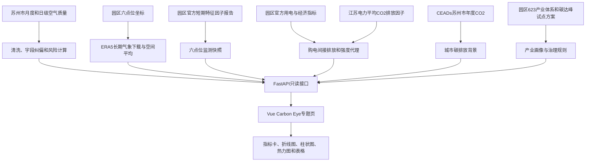

# 园区碳眼：数据来源与功能模块解读

## 1. 一句话理解“园区碳眼”

“园区碳眼”不是正式碳核算系统，而是一套面向苏州工业园区治理场景的多源数据融合原型。系统把苏州市长期空气质量背景、园区短期官方环境监测、园区用电与购电间接排放代理、长期气象再分析和产业治理规则放到同一页面，帮助使用者识别污染压力、观察能源和碳强度变化，并形成减污降碳协同治理的排查顺序。

系统的核心论证是：

> 在缺少企业级连续能耗、燃料和碳排放清单的条件下，本系统通过“城市环境背景 + 园区监测快照 + 园区购电间接排放代理 + 三维协同态势”形成可复核的治理辅助证据链；其结论用于趋势观察和治理优先级判断，不替代环境源解析、企业碳核查或现场审计。

## 2. “双碳”在本系统中具体指什么

“双碳”通常指碳达峰与碳中和。对本系统而言，不能把 AQI、PM2.5、O3、NO2、SO2 或 CO 直接当成 CO2 排放量。系统将“双碳”拆成三个可以分别验证的层次。

| 层次 | 系统证据 | 回答的问题 | 与双碳的关系 |
|---|---|---|---|
| 环境压力层 | AQI、PM2.5、O3、NO2、SO2、CO、园区特征因子 | 当前或历史上环境压力如何变化 | 减污治理对象，不等于碳排放 |
| 能源与碳代理层 | 全社会用电、工业用电、电力排放因子、GDP、规上工业总产值 | 园区购电活动及其间接排放代理如何变化 | 反映购电相关 Scope 2 代理，不是园区总排放 |
| 协同决策层 | PRI、EAI、CEI、实验性 CDCI、治理规则 | 污染压力与能源、碳强度背景是否同时值得关注 | 用于减污降碳协同排查和建议排序 |

因此，“碳眼”不是一台直接测量 CO2 的传感器。它更接近一个证据整合和决策解释工具。

## 3. 系统总体数据流



## 4. 术语与缩写

| 术语 | 全称或定义 | 本系统中的用途 |
|---|---|---|
| AQI | 空气质量指数 | 表示空气质量综合水平，作为城市环境背景 |
| PM2.5 | 细颗粒物 | 颗粒物累积风险观察指标 |
| PM10 | 可吸入颗粒物 | 扬尘、颗粒物等治理线索之一 |
| O3 | 臭氧 | 光化学污染风险观察指标 |
| NO2 | 二氧化氮 | 含氮燃烧活动指示指标，不直接等同交通源 |
| SO2 | 二氧化硫 | 含硫燃料或工业燃烧可能关联指标 |
| CO | 一氧化碳 | 燃烧活动相关空气污染指标，不是 CO2 |
| PRI | Pollution Risk/Pressure Index，污染压力指数 | 月度污染压力的项目原型指标，0至100 |
| EAI | Energy Activity Index，能源活动指数 | 基于年度全社会用电量和同比的相对指数 |
| CEI | Carbon Emission Intensity Index，碳排强度指数 | 基于每万元 GDP 购电间接排放代理强度的相对指数 |
| CDCI | Carbon and Pollution Co-governance Situation Index | 减污降碳协同态势指数，实验性原型 |
| Scope 2 代理 | 购电产生的间接排放位置法代理 | 只覆盖购电，不代表园区完整 Scope 2 或总排放 |
| ERA5 | ECMWF 第五代全球再分析数据 | 为六个园区点位提供统一模型的长期气象数据 |
| ND | Not Detected，未检出 | 监测结果低于检出限，不按数值 0 参与平均 |

## 5. 全部数据来源

### 5.1 来源总表

| 编号 | 数据集与发布者 | 时间和空间尺度 | 系统用途 | 访问方式 | 关键边界 |
|---|---|---|---|---|---|
| S01 | 现有空气质量月/日数据分析报告，用户现有项目 | 苏州市级；月度 2013-12 至 2026-07，日级 2013-12-02 至 2015-07-31 | 长期空气质量、PRI、异常月份、日级案例 | 项目本地文件 | 不是园区内部连续监测；正式参赛材料仍应补充原始数据页面、许可和下载日期 |
| S02 | 苏州工业园区主要经济指标 2019 年 12 月，园区管委会 | 园区年度 | 2019 用电、GDP、规上工业总产值 | [官方 PDF](https://www.sipac.gov.cn/szgyyq/uploadfile/government/tjsj/202004/P020200422327298704570.pdf) | 年度宏观统计，不能代替企业能耗 |
| S03 | 苏州工业园区主要经济统计指标 2023 年 12 月，园区管委会 | 园区年度 | 2023 用电和经济活动 | [官方网页](https://wsdc.sipac.gov.cn/ywtk/sjkfDetailView?id=95712) | 同上 |
| S04 | 苏州工业园区主要经济统计指标 2024 年 12 月，园区管委会 | 园区年度 | 2024 用电和经济活动 | [官方网页](https://wsdc.sipac.gov.cn/ywtk/sjkfDetailView?id=98395) | 同上 |
| S05 | 苏州工业园区主要经济统计指标 2025 年 12 月，园区管委会 | 园区年度 | 2025 用电和经济活动 | [官方网页](https://wsdc.sipac.gov.cn/ywtk/sjkfDetailView?id=101715) | 同上 |
| S06 | 省级电力平均 CO2 排放因子，生态环境部、国家统计局 | 江苏省；因子参考年 2023 | 购电间接排放位置法代理计算 | [官方网页](https://www.mee.gov.cn/xxgk2018/xxgk/xxgk01/202512/t20251231_1139517.html) | 0.5827 kgCO2/kWh；不是企业市场法因子 |
| S07 | 2026 年苏州工业园区区域环境质量状况特征因子报告，园区生态环境局 | 园区 6 点位、7 天、14 项因子 | 园区官方短期监测快照 | [官方 PDF](https://www.sipac.gov.cn/gthbj/tzgg/202607/811e7861a2654de0915d0fb1514de9cc/files/1a981b7a7cec4237aa8a4259050606ab.pdf) | 不是全年均值或实时序列，不支持企业定责 |
| S08 | Open-Meteo Historical Weather API / ERA5 | 六点位日级后聚合月度；2013-12 至 2026-06 | 长期气象趋势与描述性相关 | [API 文档](https://open-meteo.com/en/docs/historical-weather-api) | 再分析数据，不是现场气象站实测；相关不等于因果 |
| S09 | 苏州工业园区“623”产业体系，园区管委会 | 园区产业分类 | 六类产业画像的官方分类基础 | [官方网页](https://www.sipac.gov.cn/szgyyq/mtjj/202601/803e21c03c3140569f9e811c28039ef2.shtml) | 只有产业名称和政策方向是官方事实 |
| S10 | 国家碳达峰试点苏州工业园区实施方案，苏州市人民政府 | 政策和治理方向 | 将治理建议与园区低碳政策任务对应 | [官方网页](https://www.suzhou.gov.cn/szsrmzf/zfwj/202405/3df5e68dcc1a4bf79947e6cbb4524968.shtml) | 不能据政策文本虚构企业完成情况 |
| S11 | 中国 290 个城市碳排放清单，CEADs | 苏州市级年度；2000 至 2019 | 苏州市年度 CO2 背景柱状图 | [数据页面](https://www.ceads.net.cn/data/carbon-inventory/) | 城市级数据，不代表苏州工业园区排放 |
| S12 | WAQI/AQICN 实时空气质量 API | 站点近期状态 | 可选实时 AQI 卡片 | [Token 申请页](https://aqicn.org/data-platform/token/) | 第三方 API；失败显示不可用或缓存状态，不长期再分发历史数据 |

说明：`source_registry.json` 的 S08 已更新为“已下载并通过校验：151 个完整月份、六点位空间平均、无大面积缺失”。对应的 `data_provenance_registry.json` 记录了来源的时间尺度、空间尺度、处理脚本和关键文件 SHA-256，用于后续答辩复核。

### 5.2 数据来源的可信度层级

| 层级 | 数据 | 解释原则 |
|---|---|---|
| 官方直接数据 | 园区用电、GDP、工业总产值、园区特征因子、江苏电力因子、政策和产业分类 | 可陈述发布值和发布范围，但不能超出其空间或时间边界 |
| 公开第三方或研究数据库 | ERA5/Open-Meteo、CEADs、WAQI | 必须标注平台、版本、尺度和许可；不能伪装成园区官方实测 |
| 项目加工结果 | 月度清洗数据、PRI、异常、强度代理、EAI、CEI、CDCI、治理建议 | 必须给公式、输入、假设和不确定性；不能称为官方标准 |

### 5.3 当前数据质量事实

| 数据项 | 已验证状态 |
|---|---|
| 月度空气质量 | 152 条，2013-12 至 2026-07 |
| 2026-07 | 部分月，`is_partial=true`，不参与年度统计、阈值训练和相关分析；实际观测天数当前为 `null` |
| 日级空气质量 | 602 条，2013-12-02 至 2015-07-31 |
| 日表字段纠偏 | 检查 20 个月，其中 18 个月完成 CO/NO2/SO2 映射纠偏，平均相对误差约 0.0182 |
| 长期气象 | 151 个完整月，2013-12 至 2026-06；27,570 条点位日记录；6 点位；无缺失 |
| 园区监测快照 | 6 点位、7 天、14 项因子、84 条结构化记录 |
| 园区年度用电 | 2019、2023、2024、2025 共 4 条；2020-2022 保持缺失 |
| 城市 CO2 背景 | 2000-2019 共 20 条苏州市年度记录 |

## 6. 页面图形语言与“图标”怎么理解

当前 Carbon Eye 页面没有使用独立的图标库来表达计算结果。页面中的英文小标签、颜色、线型、柱形、按钮高亮和状态文字共同组成视觉图例。

| 视觉元素 | 页面含义 | 是否代表模型结果 |
|---|---|---|
| 绿色英文小标签，如 `Weather`、`Intensity` | 模块类别导航 | 否，只是栏目名称 |
| 白色大数字 | 指标卡当前值 | 是，但必须结合下方单位、年份和状态读取 |
| 蓝色线或柱 | 常用于 AQI、用电量或城市 CO2 背景 | 颜色本身没有风险等级含义 |
| 青绿色线或柱 | 常用于 PM2.5、工业用电量或 CDCI | 颜色仅用于区分系列 |
| 黄色线 | 常用于 O3、排放代理或 CEI | 不是固定的“警告等级” |
| 粉红色线 | 常用于 PRI 或工业购电间接排放代理 | 不是固定的“高风险”符号 |
| 紫色线 | EAI 年度能源活动背景 | 不是官方能源预警颜色 |
| 蓝至红热力色带 | 从负相关到正相关 | 只表示相关方向和大小，不表示因果 |
| 黄色左边框说明框 | 数据边界、缺口或实验性提醒 | 是阅读警告，不是污染告警 |
| 蓝色高亮点位按钮 | 当前正在查看的园区监测点 | 交互状态，不表示该点污染更高 |
| 折线断点 | 该年份没有数据 | 明确表示缺失，不能自行补线 |
| `暂不可用`、`stale` | 实时 API 无新数据或使用旧缓存 | 表示数据服务状态，不表示空气质量好坏 |

## 7. 页面模块逐项解读

### 7.1 顶部导航、版本号与边界横幅

**页面看到什么**

- “返回项目”按钮：返回项目列表。
- 数据版本：显示当前 JSON 数据构建版本。
- 黄色边框横幅：强调城市空气质量、园区碳代理和正式核算之间的边界。

**双碳意义**

版本号保证答辩时图表和数据可以追溯；边界横幅防止把“购电间接排放代理”误解为园区总排放。

**不能这样说**

- 不能说“系统已经精确核算园区全部碳排放”。
- 不能说“苏州市空气质量就是园区内部连续监测”。

### 7.2 第一屏五张驾驶舱指标卡

#### 卡片 A：实时 AQI 状态

- **数据/API**：WAQI/AQICN，可选接口 `/api/carbon-eye/realtime-aqi`。
- **数字含义**：API 正常时显示 AQI 当前值；没有 Token、超时或第三方失败时显示“暂不可用”。
- **状态解释**：`ok` 是本次获取成功，`stale` 是返回缓存，`unavailable` 是当前没有可用数据。
- **双碳理解**：用于提供近期空气环境状态，不参与实时 CO2 或实时 CDCI 计算。
- **边界**：不长期保存和再分发第三方历史数据，不把站点近期值外推为园区全年情况。

#### 卡片 B：最新完整月 PRI

- **数据/API**：`overview.json` 与 `monthly_trends.json`。
- **显示内容**：最新完整月份、PRI 分数、绝对风险等级、主要贡献污染物。
- **双碳理解**：回答“近期区域污染压力主要由什么污染物贡献”，为减污治理排序提供依据。
- **边界**：PRI 是项目原型，不是官方空气质量标准，也不是碳排放量。

#### 卡片 C：最新购电间接排放代理

- **数据/API**：`park_electricity_emissions.json`。
- **显示内容**：最新有数据年份的全社会购电间接排放位置法代理值，单位为万吨 CO2。
- **双碳理解**：回答“园区购电活动对应的间接排放代理规模如何”。
- **边界**：不包括直接燃烧、外购热力、工业过程、交通和废弃物，也没有进行绿电绿证市场法调整。

#### 卡片 D：年度 EAI / CEI

- **数据/API**：`cdci.json`。
- **EAI**：年度能源活动相对指数，综合全社会用电量和同比变化。
- **CEI**：年度购电间接排放强度相对指数，基于 tCO2/万元 GDP。
- **双碳理解**：EAI 看能源活动规模压力，CEI 看单位经济产出的购电排放代理强度，两者应分开阅读。
- **边界**：0 至 100 是项目样本内相对位置，不是国家考核分数。

#### 卡片 E：数据质量

- **数据/API**：`data_quality.json`。
- **显示内容**：长期气象月份数、监测点位数、短期快照记录数。
- **双碳理解**：展示系统结论的证据覆盖范围，帮助评委判断结果是否可复核。
- **边界**：记录多不等于空间和时间上完全代表园区，仍需看每类数据的尺度。

### 7.3 城市长期空气质量与污染压力折线图

**图中系列**

| 颜色 | 系列 | 单位或范围 | 阅读重点 |
|---|---|---|---|
| 蓝色 | AQI | AQI 指数 | 看综合空气质量水平的月度波动和长期变化 |
| 青绿色 | PM2.5 | µg/m3 | 看颗粒物污染的季节累积和长期改善 |
| 黄色 | O3 | µg/m3 | 看暖季光化学污染风险是否突出 |
| 粉红色 | PRI | 0至100 | 看多污染物综合压力的项目内排序 |

**数据来源与时间**

- 数据/API：`monthly_trends.json`，接口 `/api/carbon-eye/monthly-trends`。
- 时间：2013-12 至 2026-07，共 152 条。
- 空间：苏州市级背景，不是园区内部连续监测。
- 交互：鼠标悬停查看当月值；下方滑块或滚轮缩放时间区间。

**双碳项目怎么理解**

这张图承担“减污”证据链的主线。PM2.5 下降可以说明区域颗粒物环境压力发生变化，O3 的季节性波动提示传统颗粒物治理之外还需关注 VOCs 与 NOx 协同控制。PRI 将多个污染物压缩为便于排序的压力指标，但它不直接测量 CO2。

**特殊标识**

2026-07 是部分月。页面可以展示它，但它不参与年度均值、同比、阈值基线、模型训练和气象相关分析。由于当前实际观测天数为 `null`，不能自行写成某个确定天数。

**不能这样说**

- 不能把 PM2.5 下降直接写成碳排放下降。
- 不能把 NO2 上升直接认定为交通源增加。
- 不能忽略 2026 年 3 月前后 AQI 标准版本变化对跨期比较的影响。

### 7.4 园区六点位 ERA5 长期气象组合图

**图中系列**

| 颜色和图形 | 指标 | 单位 | 图形选择原因 |
|---|---|---|---|
| 黄色折线 | 平均气温 | °C | 连续变量，适合观察季节周期 |
| 蓝色折线 | 平均风速 | km/h | 连续变量，适合观察扩散条件变化 |
| 青色柱状 | 月降水量 | mm | 累积量，柱状图更容易比较月份总量 |

**数据来源与处理**

- 数据/API：Open-Meteo 历史 API 的 ERA5 数据，接口 `/api/carbon-eye/weather-long-term`。
- 时间：2013-12 至 2026-06，共 151 个完整月。
- 空间：先对 6 个园区官方监测点分别提取日数据，再计算园区空间平均。
- 数据量：27,570 条点位日记录，缺失值为 0。
- 风向：使用圆形平均，避免 359° 与 1° 被错误平均成 180°。

**双碳项目怎么理解**

气象数据用来区分“排放活动变化”和“扩散、光化学条件变化”这两类解释。例如，高温和强辐射条件常与 O3 较高同时出现，低风速和少降水条件可能与颗粒物累积同时出现。气象模块让治理建议不只看污染物数值，还看环境条件是否支持污染生成或累积。

**边界**

ERA5 是再分析数据，不是园区气象站的现场实测。它能支持一致的长期描述，但不能单独证明某个气象因素“导致”某次污染。

### 7.5 气象与污染描述性相关热力图

**横纵坐标**

- 横轴：O3、PM2.5、NO2。
- 纵轴：温度、日照、短波辐射、风速、降水、湿度、气压。
- 单元格数字：按月份去除季节均值后的 Pearson 相关系数。
- 鼠标悬停：同时显示原始 Pearson、Spearman、去季节 Pearson 和样本量 `n`。

**颜色怎么读**

| 颜色 | 数值方向 | 含义 |
|---|---|---|
| 深蓝 | 接近 -1 | 一个变量较高时，另一个倾向较低 |
| 浅蓝或近白 | 接近 0 | 线性相关较弱 |
| 浅红至深红 | 接近 +1 | 两个变量倾向同向变化 |

颜色深浅表示相关方向和大小，不代表污染等级，也不表示因果强度。

**为什么有三种相关系数**

- Pearson：观察线性相关。
- Spearman：观察排序关系，对极端值和非线性单调关系更稳健。
- 去季节 Pearson：先减去每个自然月的多年平均，再观察偏离季节常态的共同变化，减少“夏天本来就热、O3 本来就高”造成的伪相关。

**项目中的代表性结果**

| 指标对 | Pearson | Spearman | 去季节 Pearson | n | 可支持的表述 |
|---|---:|---:|---:|---:|---|
| O3 与短波辐射 | 0.8402 | 0.8530 | 0.5184 | 151 | 两者存在较稳定的正向描述性关联 |
| O3 与日照 | 0.5319 | 0.5449 | 0.5009 | 151 | 日照偏高月份常伴随 O3 偏高 |
| O3 与温度 | 0.8024 | 0.7686 | 0.2347 | 151 | 原始季节相关较强，去季节后明显减弱 |
| PM2.5 与温度 | -0.6680 | -0.7349 | -0.3178 | 151 | PM2.5 与温度呈负向描述性关联 |
| NO2 与温度 | -0.5970 | -0.5992 | -0.3977 | 151 | NO2 与温度呈负向描述性关联 |

**双碳项目怎么理解**

热力图为治理建议提供“环境条件解释层”。它不能算碳排放，但有助于避免把每次污染波动都归因于排放活动，从而让减污措施更审慎。

### 7.6 2026 年 6 月园区六点位特征因子监测快照

**页面构成**

1. 左侧点位列表：G1 至 G6，显示点位名称和功能区。
2. 蓝色高亮：表示当前选择的点位，不表示该点污染最重。
3. 右侧表格：显示该点位的 14 项特征因子、观测范围、评价限值、单位和达标状态。

**点位与功能区**

| 点位 | 名称 | 功能区 |
|---|---|---|
| G1 | 胜浦（金淞湾花园西南侧） | 高端制造与国际贸易区 |
| G2 | 出口加工区（南侧空地） | 高端制造与国际贸易区 |
| G3 | 东沙湖 | 高端制造与国际贸易区 |
| G4 | 金鸡湖学校苏桐路校区 | 金鸡湖商务区 |
| G5 | 度假区（星湖医院） | 阳澄湖半岛旅游度假区 |
| G6 | 科创区（独墅湖医院） | 独墅湖科教创新区 |

**数据/API**

- 文件：`park_environment_snapshot.json`。
- 接口：`/api/carbon-eye/park-environment-snapshot`。
- 摘要：6 点位、7 天、14 项因子、84 条记录。
- 监测时间：2026-06-01 至 06-02、06-05 至 06-09。

**ND 怎么理解**

`ND` 在页面中显示为“未检出”。它表示低于分析方法检出限，不等于真实浓度严格为 0，因此不能按 0 参与平均后得出“完全没有该污染物”的结论。

**双碳项目怎么理解**

该模块补足“园区尺度”的环境证据。城市长期序列用于看多年背景，园区六点位快照用于看短期特征因子，两者不能混成同一时间序列。特征因子可提示需要关注 VOCs、酸雾、含氮或含硫活动，但不能据此确定具体企业责任。

### 7.7 苏州市年度 CO2 背景柱状图

**图形**

- 蓝色柱状图。
- 横轴：2000-2019 年。
- 纵轴：百万吨 CO2。
- 数据/API：CEADs 中国 290 个城市碳排放清单，接口 `/api/carbon-eye/carbon-emissions`。

**为什么使用柱状图**

城市 CO2 是年度总量，柱状图适合比较不同年份的规模，不暗示日级连续变化。

**双碳项目怎么理解**

这张图提供苏州市所在区域的长期碳排放背景，回答“苏州城市层面的年度排放规模如何变化”。它帮助说明园区治理所处的区域背景，但不参与日级空气质量预警。

**边界**

- 不能把苏州市 231.19 百万吨 CO2 等城市级数值写成苏州工业园区数值。
- 不能把 2019 年后的空白解释为排放下降，当前数据集只是没有更新到更晚年份。

### 7.8 园区用电量与购电间接排放代理组合图

**图中系列**

| 颜色和图形 | 系列 | 单位 |
|---|---|---|
| 蓝色柱 | 全社会用电量 | 亿 kWh |
| 青绿色柱 | 工业用电量 | 亿 kWh |
| 黄色折线 | 全社会购电间接排放代理 | 万吨 CO2 |
| 粉红色折线 | 工业购电间接排放代理 | 万吨 CO2 |

**为什么柱线组合**

柱表示能源活动规模，线表示将用电量乘以排放因子后的碳代理。左右两个纵轴的单位不同，不能直接比较柱高和线高的视觉距离。

**计算公式**

```text
购电间接排放代理（万吨 CO2）
= 用电量（亿 kWh） × 5.827

其中：5.827 = 0.5827 kgCO2/kWh 的单位换算结果
```

**现有年度结果**

| 年份 | 全社会用电量（亿 kWh） | 工业用电量（亿 kWh） | 全社会代理（万吨 CO2） | 工业代理（万吨 CO2） |
|---:|---:|---:|---:|---:|
| 2019 | 137.8063 | 92.8687 | 802.997 | 541.146 |
| 2020 | 缺失 | 缺失 | 缺失 | 缺失 |
| 2021 | 缺失 | 缺失 | 缺失 | 缺失 |
| 2022 | 缺失 | 缺失 | 缺失 | 缺失 |
| 2023 | 154.7894 | 92.3556 | 901.958 | 538.156 |
| 2024 | 170.4930 | 102.0132 | 993.463 | 594.431 |
| 2025 | 179.4286 | 107.4379 | 1045.530 | 626.041 |

**断点怎么理解**

2020-2022 没有可靠的年度官方数据，因此柱和线保持空白，折线设置为不连接缺失值。断点是数据诚信设计，不是图表故障。

**双碳项目怎么理解**

该图是系统中最直接的“碳”模块。它将园区官方用电活动转换为购电相关的间接排放位置法代理，用于比较规模和趋势。

**固定边界**

- 不含煤、气、油等直接燃烧。
- 不含外购热力。
- 不含工业过程。
- 不含交通和废弃物。
- 未按绿电和绿证进行市场法调整。
- 2019、2024、2025 统一采用 2023 江苏因子，仅用于横向比较情景。

### 7.9 园区用电与购电间接排放强度代理折线图

**图中四条线**

| 颜色 | 指标 | 单位 | 回答的问题 |
|---|---|---|---|
| 蓝色 | 每万元 GDP 用电量 | kWh/万元 | 经济产出对应多少全社会用电 |
| 青绿色 | 每万元规上工业总产值工业用电量 | kWh/万元 | 工业产出对应多少工业用电 |
| 黄色 | 每万元 GDP 购电代理强度 | tCO2/万元 | 经济产出对应多少购电间接排放代理 |
| 粉红色 | 每万元规上工业总产值工业购电代理强度 | tCO2/万元 | 工业产出对应多少工业购电排放代理 |

**代表性结果**

每万元 GDP 购电代理强度从 2019 年的 0.2927 tCO2/万元降至 2023 年的 0.2447，2024 年为 0.2482，2025 年为 0.2511。可表述为“宏观购电排放代理强度相较 2019 年降低，但 2023-2025 有小幅回升”。

**双碳项目怎么理解**

总量增加不一定代表效率变差。强度图将能源和碳代理除以经济产出，用于观察“单位经济活动对应的用电或购电排放代理”。它比只看总量更接近低碳发展效率问题。

**边界**

GDP 和规上工业总产值是宏观分母，不能替代企业碳强度、产品碳足迹或行业核查结果。

### 7.10 PRI、EAI、CEI 三维协同态势与实验性 CDCI

**图中四条线**

| 颜色 | 指标 | 时间尺度 | 含义 |
|---|---|---|---|
| 粉红色 | PRI | 月度 | 污染压力 |
| 紫色 | EAI | 年度背景映射到月份 | 能源活动相对压力 |
| 黄色 | CEI | 年度背景映射到月份 | 购电间接排放强度相对压力 |
| 青绿色粗线 | CDCI | 月度 PRI + 年度背景 | 实验性协同态势总分 |

**为什么默认强调三维，而不是只看一个总分**

EAI 的用电量和 CEI 的购电排放代理都与电力活动有关，若简单加权，可能重复计算同一信息。因此页面先展示 PRI、EAI、CEI 三条维度，再把 CDCI 明确标为实验性选项。

**公式**

```text
CDCI = 0.5 × PRI + 0.2 × EAI + 0.3 × CEI
```

**可计算年份**

只有 2019、2023、2024、2025 同时具有年度能碳数据，因此仅对这四个年份中的 48 个月计算。2020-2022 不计算，不用机器学习拟合权重。

**双碳项目怎么理解**

- PRI 高：环境污染治理压力较高。
- EAI 高：年度能源活动规模或增速处于样本较高位置。
- CEI 高：单位 GDP 的购电间接排放代理强度处于样本较高位置。
- 三者同时高：更值得开展减污和节能降碳联合排查。
- 只有某一维高：应按该维度制定更有针对性的措施，不应被一个总分掩盖。

**边界**

年度 EAI/CEI 被映射到同一年的每个月，属于混合时间频率。实时 AQI 不能被显示为“实时 CDCI”。

### 7.11 CDCI 权重敏感性分析表

**为什么要做敏感性分析**

CDCI 权重来自项目假设，不是官方标准。敏感性分析用不同权重重新计算，观察月份排序和等级是否稳定，从而诚实展示“结论对权重有多敏感”。

**三组权重**

| 方案 | PRI | EAI | CEI |
|---|---:|---:|---:|
| 基准 | 0.5 | 0.2 | 0.3 |
| 能源权重提高 | 0.4 | 0.3 | 0.3 |
| 等权 | 1/3 | 1/3 | 1/3 |

**表格三列指标怎么读**

- 排名 Spearman：与基准方案的月份排名一致程度，越接近 1 越稳定。
- 高风险月重合率：两个方案识别出的高风险月份有多少重合。
- 等级变化率：更换权重后有多少月份改变风险等级，越低越稳定。

**当前结果**

| 对比方案 | 排名 Spearman | 高风险月重合率 | 等级变化率 |
|---|---:|---:|---:|
| 0.4/0.3/0.3 | 0.9330 | 33.3% | 25.0% |
| 等权 | 0.9319 | 33.3% | 29.2% |

这些结果说明整体排序较相近，但高风险月份集合和等级仍会明显变化。因此 CDCI 可用于实验展示，不能当成已经科学定型的考核指标。

### 7.12 相对异常与绝对风险表

**两项判断必须分开**

1. 相对异常：该月是否超过 2013-2022 年历史同月 90% 分位数。
2. 绝对风险：该月 PRI 分数属于低、中、高哪个等级。

| 相对异常 | 绝对风险 | 正确解释 |
|---|---|---|
| 是 | 高 | 相对历史异常且绝对污染压力高，优先关注 |
| 是 | 低 | 与历史同月相比异常，但当前绝对水平仍低 |
| 否 | 高 | 未超历史同月阈值，但绝对污染压力仍高 |
| 否 | 低 | 当前处于历史常态且绝对压力低 |

**为什么这很重要**

例如 2024-08 的 AQI 和 O3 超过历史同月阈值，但 PRI 为 23.8，属于低风险。正确表述是“出现相对异常，尚未达到项目定义的中高绝对风险”，不能直接写成“严重污染预警”。

**表格字段**

- 月份：异常发生时间。
- 是否超过历史同月阈值：当前异常表中均为“是”。
- 触发项：实际值与 90% 分位阈值，例如 `o3(148.0>135.4)`。
- 绝对风险：PRI 分数与等级。
- 主要贡献污染物：PRI 加权贡献最高项。
- 风险类型：非因果命名，如“含氮燃烧活动指示型”。
- 适用治理建议：按触发规则生成的排查方向。

**风险类型的严谨表达**

| 风险类型 | 可表达的含义 | 不可表达的结论 |
|---|---|---|
| 臭氧光化学风险型 | O3 贡献突出，建议关注 VOCs 与 NOx 协同控制 | 已确定某企业造成臭氧污染 |
| 颗粒物累积风险型 | PM2.5/PM10 贡献突出，建议复核扬尘与燃烧活动 | 已确定污染来自施工或锅炉 |
| 含氮燃烧活动指示型 | NO2 等指标提示含氮燃烧或交通活动值得排查 | 确定来自交通 |
| 含硫工业燃烧可能关联型 | SO2 或硫酸雾提示含硫活动值得核查 | 确定来自某工业企业 |
| 多污染物复合风险型 | 多个污染物共同贡献 | 已完成正式源解析 |

### 7.13 日级历史案例回放表

**数据/API**

- 文件：`daily_cases.json`。
- 接口：`/api/carbon-eye/daily-cases`。
- 原始日数据：602 条，2013-12-02 至 2015-07-31。

**表格字段**

日期、AQI、PM2.5、O3_8h、PRI 绝对风险、风险类型和建议。

**日表纠偏是什么**

日表的 CO、NO2、SO2 字段顺序存在异常。构建流程将 6 种可能映射分别聚合到月均值，与月表对应月份比较并选择误差最小映射。20 个重叠月份中 18 个月需要纠偏，平均相对误差约 0.0182。

**双碳项目怎么理解**

该模块用于答辩时回放具体历史日期，展示“数据进入系统后如何形成风险解释和治理建议”。它只证明原型流程可以作用于日数据，不代表系统已经拥有 2016-2026 的连续日级预警能力。

### 7.14 园区产业画像卡片

**六类官方产业**

1. 新一代信息技术。
2. 高端装备制造。
3. 生物医药及大健康。
4. 纳米技术应用及新材料。
5. 人工智能及数字产业。
6. 新能源及绿色产业。

**每张卡片四层信息**

- 产业名称：来自园区“623”产业体系。
- 官方定位：来自园区政策和产业资料。
- 能碳特征或 KPI：项目专家规则模板。
- 建议方向：项目专家规则模板，需企业数据和现场审计确认。

**各产业怎样与双碳结合**

| 产业 | 主要能碳关注点 | 可展示的治理方向 |
|---|---|---|
| 新一代信息技术 | 洁净室、工艺冷却、空压系统和购电间接排放 | 绿电、冷站优化、洁净室压差与温湿度优化 |
| 高端装备制造 | 电机、热处理、焊接、涂装及电力与燃气 | 电机系统节能、余热回收、VOCs 全过程管控 |
| 生物医药及大健康 | 洁净空调、蒸汽、冷冻和冷链 | 分区分时控制、冷凝水和余热回收、冷站提效 |
| 纳米技术及新材料 | 工艺热、特种气体、高温和高洁净工序 | 能量梯级利用、废气分类治理、低碳原料和绿电 |
| 人工智能及数字产业 | 数据中心电力和制冷 | PUE、服务器利用率、绿电、液冷或自然冷却 |
| 新能源及绿色产业 | 制造环节能源、材料隐含碳和生命周期 | 产品碳足迹、再生材料、绿电和回收闭环 |

**边界**

这些卡片是“园区场景知识库”，不是六个行业的真实排放清单，也不能证明某家企业已经实施了建议。

### 7.15 治理建议解释模块

**实现方式**

当前版本使用专家规则模板，不调用大模型。每条建议显示触发依据、适用产业、建议动作和数据缺口。

**主要规则**

| 触发依据 | 建议方向 | 仍缺少的数据 |
|---|---|---|
| O3 较高且温度、日照或短波辐射相对较高 | VOCs 与 NOx 协同控制，涉 VOCs 工序错峰复核 | 企业 VOCs 排放和工序时段 |
| PM2.5 较高且低风速或少降水 | 复核颗粒物、施工扬尘和燃烧活动管理 | 实时扬尘和燃烧清单 |
| NO2 贡献较高 | 优先复核含氮燃烧和交通活动 | 正式源解析和交通流量 |
| SO2 或硫酸雾特征较高 | 核查含硫燃料、酸雾收集和治理设施 | 企业设施运行台账 |
| 购电强度代理较高 | 评估绿电、冷站、空压、洁净室和电机系统优化 | 企业或行业负荷曲线 |

**双碳项目怎么理解**

治理建议把环境侧和能源侧的数据转化为行动方向，体现“监测不止用于展示，而是服务决策”。不过它输出的是优先排查清单，不是行政执法结论或企业责任认定。

### 7.16 方法、质量与来源模块

**页面显示什么**

- PRI 公式。
- 实验性 CDCI 公式。
- 相对异常规则。
- 气象相关规则。
- 数据来源链接。

**当前实现细节**

`/api/carbon-eye/sources` 返回 12 个来源，但页面为了控制篇幅只展示 `sources.slice(0, 5)`，即前 5 项。本文档列出了全部 12 项。若后续希望网页直接展示全部来源，应改为分页、折叠列表或完整来源弹窗，而不是继续只截取前 5 项。

### 7.17 数据边界与不确定性模块

该模块集中列出以下限制：

- 城市级空气质量不等于园区内部连续监测。
- 园区 7 天快照不等于全年或实时序列。
- 苏州市 CO2 背景不等于园区 CO2。
- 购电间接排放位置法代理不等于园区总碳排放。
- 气象相关不等于因果。
- 治理规则不等于企业定责或现场审计。
- 2020-2022 年用电数据保持缺失。
- 2026-07 为部分月。

这部分不是“自我否定”，而是科学可信度的重要组成部分。竞赛评委通常会关注系统是否知道自己的证据边界。

### 7.18 加载、错误、空数据和页脚状态

- “正在加载专题数据”：前端正在并行请求 Carbon Eye 接口。
- 红色错误框：至少一个核心请求失败，应检查 Render 服务、CORS 或缺失 JSON。
- “暂无……数据”：接口返回成功但记录为空，页面不会把空白图误装成正常结果。
- 图表滑块：用于缩放时间范围，不改变原始数据。
- 页面底部固定声明：再次说明系统是协同预警与治理决策原型，不是正式碳核算系统。

这些状态是工程可靠性模块。它们不参与双碳计算，但能防止网络或数据缺失时向用户展示误导性结果。

## 8. 核心指标公式与计算例子

### 8.1 污染压力指数 PRI

```text
PRI = 0.25 × NO2标准化值
    + 0.20 × SO2标准化值
    + 0.20 × CO标准化值
    + 0.20 × PM2.5标准化值
    + 0.15 × O3标准化值
```

标准化采用当前分析数据集内的最小值和最大值，将各污染物转换到 0至100 的相对尺度。等级为：

- 0至40：低风险。
- 40至70：中风险。
- 70至100：高风险。

这些权重是可解释的项目假设，不是官方权威公式。AQI 不重复进入 PRI，以减少和污染物浓度的重复计量。

### 8.2 相对异常

```text
当月某指标 > 2013-2022年该自然月的90%分位数
则该指标记为相对异常项
```

例如 2024-08 的 O3 为 148.0，历史 8 月 90% 分位阈值为 135.4，因此 O3 触发相对异常。

### 8.3 购电间接排放位置法代理

```text
用电量（kWh） × 江苏电力平均CO2排放因子（kgCO2/kWh）
= 购电间接排放代理（kgCO2）
```

以 2025 年全社会用电为例：

```text
179.4286 亿 kWh × 5.827
= 1045.530 万吨 CO2
```

这是统一因子横向比较情景，不是 2025 年正式碳清单。

### 8.4 强度代理

```text
每万元GDP用电量
= 全社会用电量 / 园区GDP

每万元GDP购电间接排放代理强度
= 全社会购电间接排放代理 / 园区GDP
```

工业指标使用工业用电量和规上工业总产值作为分子、分母。

### 8.5 EAI、CEI 与 CDCI

```text
EAI = 0.7 × 全社会用电量相对位置
    + 0.3 × 用电同比相对位置

CEI = 每万元GDP购电间接排放代理强度的相对位置

CDCI = 0.5 × PRI + 0.2 × EAI + 0.3 × CEI
```

EAI 与 CEI 都按现有四个年度点做相对归一化。由于样本只有 4 个年度，不进行机器学习权重拟合，也不报告统计显著性。

## 9. 数据文件到页面模块的对应关系

| 页面模块 | 核心 JSON/CSV | 后端接口 |
|---|---|---|
| 驾驶舱总览 | `overview.json`、`data_quality.json` | `/overview`、`/data-quality` |
| 城市长期趋势 | `monthly_trends.json` | `/monthly-trends` |
| 实时 AQI | 不长期落盘，第三方 API + 内存缓存 | `/realtime-aqi` |
| 长期气象 | `weather/weather_park_monthly.json` | `/weather-long-term` |
| 气象相关 | `weather/weather_air_correlations.json` | `/weather-correlations` |
| 园区监测快照 | `park_environment_snapshot.json` | `/park-environment-snapshot` |
| 城市 CO2 背景 | `carbon_emissions.json` | `/carbon-emissions` |
| 园区购电排放代理 | `park_electricity_emissions.json` | `/park-electricity-emissions` |
| 经济和碳强度代理 | `sip_economic_carbon_intensity.json` | `/economic-carbon-intensity` |
| 三维态势与 CDCI | `cdci.json` | `/cdci` |
| CDCI 敏感性 | `cdci_sensitivity.json` | `/cdci-sensitivity` |
| 相对异常 | `warnings.json` | `/warnings` |
| 日级案例 | `daily_cases.json` | `/daily-cases` |
| 产业画像 | `industry_profile.json` | `/industry-profile` |
| 治理解释 | `governance_explanation.json` | `/governance-explanation` |
| 方法与边界 | `methodology.json`、`metadata.json` | `/methodology`、`/overview` |
| 全部来源 | `source_registry.json` | `/sources` |

接口表中的路径均省略统一前缀 `/api/carbon-eye`。

## 10. 全部 Carbon Eye 接口说明

| 接口 | 返回内容 | 当前页面是否直接使用 |
|---|---|---:|
| `GET /api/carbon-eye/overview` | 项目定位、版本、最新完整月、风险摘要、局限性 | 是 |
| `GET /api/carbon-eye/monthly-trends` | 152 条月度空气质量和 PRI | 是 |
| `GET /api/carbon-eye/weather-2024` | 旧版 2024 年 12 个月气象数据 | 否，保留兼容 |
| `GET /api/carbon-eye/carbon-emissions` | 苏州市 2000-2019 年 CO2 背景 | 是 |
| `GET /api/carbon-eye/warnings` | 相对异常月份与绝对风险 | 是 |
| `GET /api/carbon-eye/daily-cases` | 2013-2015 日级案例 | 是 |
| `GET /api/carbon-eye/methodology` | PRI、CDCI、异常和气象规则 | 是 |
| `GET /api/carbon-eye/realtime-aqi` | AQICN 当前状态、污染物值、缓存或错误信息 | 是 |
| `GET /api/carbon-eye/park-carbon-estimate` | 旧版园区碳估算兼容数据 | 否，主页面已改用购电代理 |
| `GET /api/carbon-eye/park-electricity-emissions` | 园区用电和购电间接排放代理 | 是 |
| `GET /api/carbon-eye/economic-carbon-intensity` | 用电和购电排放强度代理 | 是 |
| `GET /api/carbon-eye/park-environment-snapshot` | 六点位特征因子快照 | 是 |
| `GET /api/carbon-eye/weather-long-term` | 六点位 ERA5 长期月度气象 | 是 |
| `GET /api/carbon-eye/weather-correlations` | Pearson、Spearman、去季节 Pearson 和 n | 是 |
| `GET /api/carbon-eye/cdci` | PRI/EAI/CEI 与实验性 CDCI | 是 |
| `GET /api/carbon-eye/cdci-sensitivity` | 三组权重的稳定性对比 | 是 |
| `GET /api/carbon-eye/industry-profile` | 六类产业画像 | 是 |
| `GET /api/carbon-eye/governance-explanation` | 规则驱动治理建议 | 是 |
| `GET /api/carbon-eye/data-quality` | 记录数、缺失、部分月和纠偏结果 | 是 |
| `GET /api/carbon-eye/sources` | 12 项来源登记 | 是 |
| `GET /healthz` | 后端服务和静态数据健康状态 | 页面不直接展示，用于部署健康检查 |

Carbon Eye 页面通过 `Promise.all` 并行请求 18 个直接使用的专题接口。任何核心接口报错时，页面会显示加载错误；图表没有数据时应显示明确的空状态，而不是保留大块空白。

## 11. 各模块与“双碳”治理任务的对应关系

| 双碳治理任务 | 对应模块 | 系统能做什么 | 系统暂时不能做什么 |
|---|---|---|---|
| 环境质量监测 | 城市长期趋势、实时 AQI、园区快照 | 观察区域背景和园区短期特征因子 | 不能代替园区全覆盖连续监测网络 |
| 污染异常识别 | PRI、相对异常、日级回放 | 找出偏离历史同月的月份和主要贡献污染物 | 不能完成正式污染源解析 |
| 能源活动观察 | 全社会和工业用电、EAI | 比较年度能源活动规模和变化 | 不能给出企业、行业的真实负荷曲线 |
| 购电间接排放估算 | Scope 2 位置法代理 | 计算园区购电相关间接排放代理 | 不能得到园区总碳排放或市场法排放 |
| 低碳效率观察 | 用电和排放强度代理、CEI | 观察单位 GDP 或工业产出的宏观代理强度 | 不能替代企业碳强度和产品碳足迹 |
| 协同治理 | 三维态势、实验性 CDCI | 同时比较污染、能源活动和碳强度背景 | 不能作为政府正式考核或执法评分 |
| 分类施策 | 产业画像、治理建议 | 将风险线索映射到节能、绿电和污染治理方向 | 不能替代企业现场审计和改造方案设计 |

## 12. 当前已实现、暂不可用与待补功能

### 12.1 已实现

- 苏州市 152 条月度空气质量长期趋势。
- PRI、相对异常和绝对风险拆分。
- 602 条日级数据的字段纠偏和案例回放。
- 六点位 ERA5 长期气象与描述性相关。
- 园区 6 点位、14 项、84 条官方短期快照。
- 2019、2023、2024、2025 园区用电和购电间接排放代理。
- 用电与购电排放强度代理。
- PRI/EAI/CEI 三维态势、实验性 CDCI 和敏感性分析。
- 六类园区产业画像和规则驱动治理建议。
- FastAPI 只读接口和 Vue/ECharts 页面。

### 12.2 数据存在但有明确缺口

| 缺口 | 页面表现 | 正确处理 |
|---|---|---|
| 2020-2022 园区用电 | 柱线图断点 | 不插值、不倒推 |
| 2026-07 空气质量部分月 | 页面醒目标识 | 排除年度统计、阈值和相关分析 |
| 2016 年后日级空气质量 | 日级案例停在 2015-07-31 | 不用月数据伪造日数据 |
| 2019 年后 CEADs 城市 CO2 | 城市背景柱状图停在 2019 | 不把空白解释为下降 |
| 企业能耗、天然气、热力和工艺排放 | 无企业核算图 | 只能保留接口和未来数据模板 |

### 12.3 可能暂不可用

实时 AQI 依赖用户在 Render 环境变量中配置 `AQICN_TOKEN`，且第三方服务可能失败。此时系统显示 `unavailable` 或 `stale`，其余静态模块继续运行。Token 不应写入源码、JSON、文档或 Git 历史。

### 12.4 后续优先补充

1. 2020-2022 年园区官方全社会和工业用电。
2. 园区天然气、外购热力、燃油和工业过程活动数据。
3. 企业或行业分项用电负荷、绿电和绿证数据。
4. 2016 年以后完整日级空气质量数据。
5. 企业排污许可和空间位置数据，用于来源背景展示而不是自动定责。
6. 遥感 NO2、CO、SO2 或 CH4 空间产品，作为园区空间证据增强。

## 13. 推荐的三分钟讲解顺序

### 第一步：先讲边界

“园区碳眼不是正式碳核算平台。空气质量数据反映环境压力，园区购电数据用于位置法间接排放代理，二者通过协同态势模块共同服务治理决策。”

### 第二步：讲环境压力

打开长期空气质量图，解释 AQI、PM2.5、O3 与 PRI。指出 PM2.5 和 O3 代表不同季节治理问题，2026-07 是部分月。

### 第三步：讲气象解释

打开气象组合图和热力图。说明系统使用六点位 ERA5 长期数据，并使用去季节相关减少季节周期干扰。强调相关不等于因果。

### 第四步：证明“园区尺度”

点击六个园区监测点，展示 14 项特征因子和达标状态。说明这是 7 天官方快照，不是全年实时监测。

### 第五步：讲真正的“碳”模块

打开园区用电与购电排放代理图。解释 0.5827 kgCO2/kWh 因子、2019/2023/2024/2025 四个年度结果和 2020-2022 断点。再用强度图区分总量和效率。

### 第六步：讲创新点

打开 PRI/EAI/CEI 三维态势。说明系统没有强制用一个分数掩盖三种不同压力；CDCI 只作为实验性原型，并公开敏感性结果。

### 第七步：落到治理

用相对异常表、产业画像和治理建议说明系统如何从数据走向行动方向，同时不做具体企业责任认定。

## 14. 常见问题与标准回答

### 问：为什么空气污染数据可以用于双碳项目？

答：空气污染物不是 CO2，但化石燃料燃烧、能源消费和部分工业过程可能同时产生温室气体和大气污染物。系统将空气污染作为“减污”维度，将园区用电和购电间接排放代理作为“降碳”维度，再进行协同态势分析，不把两者混为一谈。

### 问：为什么不能叫园区总碳排放？

答：当前只掌握园区用电和电网排放因子，未覆盖燃料直接燃烧、外购热力、工业过程、交通和废弃物，因此只能称为购电间接排放位置法代理估算。

### 问：为什么 2020-2022 年不补齐？

答：没有可靠公开年度原始值时，插值会制造不存在的官方数据。断点能清楚告诉使用者证据在哪里中断。

### 问：CDCI 是否科学权威？

答：CDCI 是实验性原型。系统公开公式、时间频率和三组敏感性分析，展示它对权重变化的敏感程度，但不把它表述为官方或行业标准。

### 问：热力图能说明气象导致污染吗？

答：不能。热力图只显示描述性相关。污染变化还可能受到排放活动、区域输送、化学反应和测量误差等因素影响。

### 问：系统能定位污染企业吗？

答：不能。系统只能给出需要优先核查的活动类型和产业场景，企业定责需要源解析、排放清单、工况和现场执法证据。

## 15. 数据可用性与复现说明

本系统使用的公开第三方和政府数据均在第 5 节列出来源页面。结构化应用数据位于项目的 `backend/data/carbon_eye/` 目录，长期气象下载、空气质量合并、风险构建和校验脚本位于 `scripts/` 目录。第三方数据的再使用应遵守原发布方的许可和署名要求。WAQI/AQICN Token 不随代码公开，实时数据不作为长期历史数据再分发。空气质量原始月表和日表的最初下载页面、许可和下载日期目前未在 `source_registry.json` 中完整登记，这是正式参赛数据可用性说明中仍需补齐的一项。

为提高数据复现性，发布数据时应至少附带：

- 数据版本和构建时间。
- 每个文件的字段字典、单位和缺失值规则。
- 原始数据与处理后数据的对应关系。
- 2026-07 部分月和 2020-2022 缺失年的处理说明。
- 日表字段纠偏算法和校验结果。
- 气象模型、点位、时间范围、聚合方式和圆形风向平均方法。
- 园区购电代理公式、排放因子年份和范围边界。
- 代码版本或 Git 提交号。

## 16. 结论

园区碳眼的价值不在于把所有数据压成一个“万能分数”，而在于把不同尺度、不同时间频率和不同证据强度的数据分层展示：城市空气质量回答长期环境背景，园区六点位快照补充园区尺度证据，ERA5 解释气象共变，园区用电和电力因子形成购电间接排放代理，产业画像与规则模板把发现转化为治理方向。只要始终保留来源、尺度、方法和不确定性，它就可以作为“双碳赛”中具有工程完整性和专业边界意识的减污降碳协同治理原型。

## 附录 A：术语禁用与推荐写法

| 不推荐表述 | 推荐表述 |
|---|---|
| 精确核算园区碳排放 | 园区购电间接排放位置法代理估算 |
| 实时监测 CO2 排放 | 实时 AQI 状态与年度购电排放代理分别展示 |
| 园区空气质量长期实测 | 苏州市级长期空气质量背景 |
| 园区全年污染监测 | 园区六点位官方短期监测快照 |
| 气象因素导致污染变化 | 气象变量与污染物存在描述性相关 |
| 确定来自交通 | 含氮燃烧和交通活动值得优先复核 |
| 已识别具体污染企业 | 不进行具体企业责任认定 |
| 正式减污降碳指数 | 减污降碳协同态势指数，实验性原型 |

## 附录 B：本说明书对应的主要项目文件

- 前端专题页：`frontend/src/views/CarbonEyeView.vue`
- 前端 API 封装：`frontend/src/api/carbonEye.js`
- 后端入口：`backend/main.py`
- 数据构建：`scripts/build_carbon_eye_data.py`
- 气象下载：`scripts/fetch_sip_weather.py`
- 气象相关分析：`scripts/analyze_weather_air.py`
- 数据校验：`scripts/validate_bundle.py`
- 数据来源登记：`backend/data/carbon_eye/source_registry.json`
- 方法说明：`backend/data/carbon_eye/methodology.json`
- 数据质量：`backend/data/carbon_eye/data_quality.json`
- 数据版本：`backend/data/carbon_eye/metadata.json`

## 附录 C：关键主张与证据对应表

| 项目主张 | 直接证据 | 支持状态 | 必须保留的限制 |
|---|---|---|---|
| 系统能够展示苏州长期空气质量变化 | 152 条苏州市月度记录 | 已支持 | 不是园区内部连续监测 |
| 系统具有园区尺度环境证据 | 六点位、7 天、14 项、84 条官方快照 | 已支持 | 只代表短期监测窗口 |
| 系统能够估算园区购电间接排放代理 | 园区官方用电量 + 江苏 2023 电力因子 | 已支持 | 不等于园区总排放或正式核算 |
| 系统能够观察宏观低碳效率变化 | GDP、工业总产值、用电和代理强度 | 已支持 | 不是企业或产品碳强度 |
| 气象条件与部分污染物存在共变 | 151 个月三类相关系数 | 已支持 | 描述性相关，不代表因果 |
| 系统能够识别异常月份 | 2013-2022 同月 90% 分位阈值，13 个异常月 | 已支持 | 相对异常和绝对风险必须分开 |
| 系统能够形成治理优先级建议 | 污染、气象、能碳代理与专家规则 | 原型支持 | 不替代源解析、审计或行政决策 |
| CDCI 是稳定、权威的正式指数 | 仅 4 个年度背景和敏感性分析 | 不支持 | 只能称实验性原型 |
